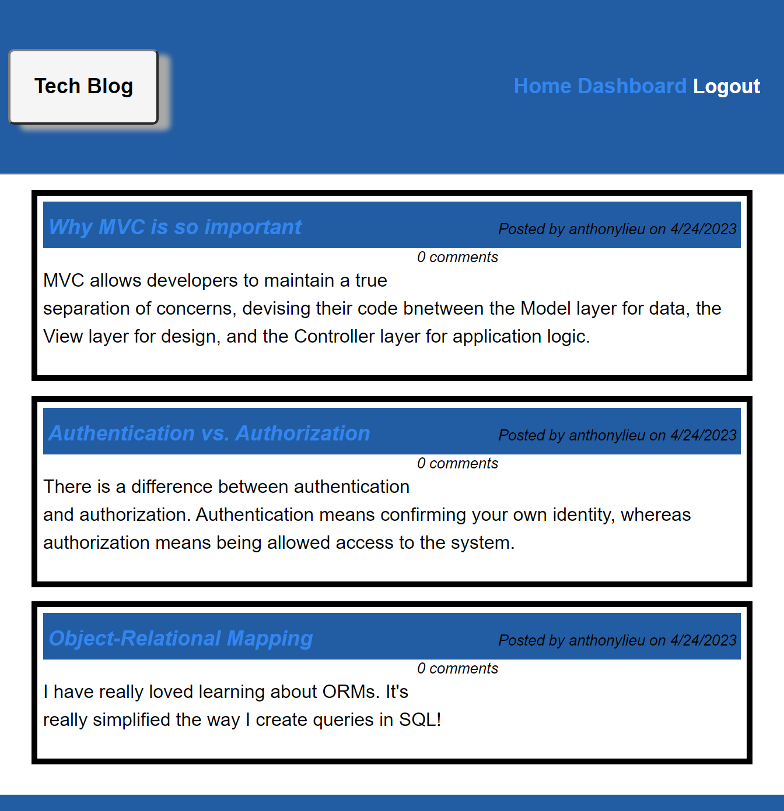

# Tech Blog

## Description

The app allows a user to sign-up, login, add and view comments in a blog setting.

## Table of Contents

- [Installation](#installation)
- [Usage](#usage)
- [Credits](#credits)
- [License](#license)

## Installation

 To install the app, clone the repo then in the terminal put in. 
 `npm i , mysql -u root -p , source db/schema.sql, npm start` 

## Usage

[Heroku:](https://module-14-mvc.herokuapp.com/)

## License

MIT

## Questions

GitHub: anthonylieu

Email: anthonylieu1@gmail.com
